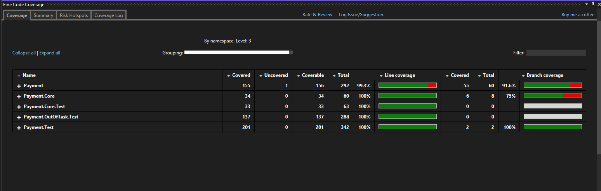

# Solution to Mangopay Technical Test

**Target of the project:** [OriginalRequests](docs/OriginalRequest.md)

## Git Folder Structure

The repository's folder structure consists of:

- **doc**: contains project documentation files.
- **src**: holds the application's source code. The solution file is located within this folder, and for each service, a separate folder has been created.
- **test**: contains the tests for each service.

## Resolution Steps

The existing tests have been considered the source of truth. 
Consequently, each time a service's logic conflicts with the test source code, modifications have been made to align with the test specifications.

### Step 1 Consideration

To achieve this task, I modified UserMemoryRepository.cs.

### Step 2 Consideration

To fix these tests, i fixed various small bugs found in the Wallet services.

### Step 3 Consideration

This task requires the implementation of "GetConnectionList," involving a shortest path algorithm.

To accomplish this task, I researched the best algorithm for unweighted graphs on the internet. 
For unweighted graphs, I found two algorithms that could be suitable:

- Breadth-First Search (BFS): commonly used to find the shortest path in an unweighted graph.
- Dijkstra's Algorithm with Uniform Edge Weights: though primarily for weighted graphs, it can efficiently work in unweighted graphs where all edges have the same weight.

I choose the first option.

### Other Considerations

Reviewing the entities in the source code, I noticed that all entities have GUIDs as PKs. 
I suggest generating entity GUIDs using the next() GUID method (an external package might be needed).

Implementing this technique aims to avoid excessive index fragmentation on PK.
An example of a performance test can be found [here](https://www.codeproject.com/Articles/32597/Performance-Comparison-Identity-x-NewId-x-NewSeque).

## Tests

### Code Coverage

I created additional test projects separately from the original ones to achieve a good code coverage.

**Before Improvements**

**After Improvements**

### Analyzing Tests

Reaching a satisfactory test coverage percentage does not guarantee well-written tests.

A useful tool to check the robustness of our tests is [Stryker](https://stryker-mutator.io/). 
Here is an example of the output:

- [Output at the first run](docs/StrykerOutput/BeforeImprovement/reports/mutation-report.html)
- [Output after fixing](docs/StrykerOutput/AfterImprovement/reports/mutation-report.html)

## Small Problems Found in the Tasks

I found some error in the [OriginalRequests](docs/OriginalRequest.md)
1. repository refer v2  ( tech-test-v2.bundle ) but this is v3
2. Tests steps number are wrong