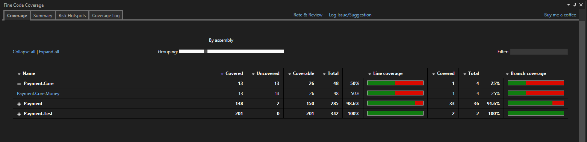

# How to user Stryker in .NET

## Git Folder Structure

The repository's folder structure consists of:

- **doc**: contains project documentation files.
- **src**: holds the application's source code.
- **test**: contains the test project.

inside src a sample project with some logic.

test project just refer payment library and contains some test.

## Code Analysis

To semplicity i use this tool to retrive the code coverage.

As we can see code coverage seems grates.

### Analyzing Tests

Reaching a satisfactory test coverage percentage does not guarantee well-written tests.

A useful tool to check the robustness of our tests is [Stryker](https://stryker-mutator.io/). 

On the solution a powershell named "" is present. Using this tool from your Developer shell in visual studio.
It's install and run stryker for you.

After the run stryker give you a mutation score:

We can see that mutation score is not very high, so we can consult stryker output for details.

- [Output at the first run](docs/StrykerOutput/BeforeImprovement/reports/mutation-report.html)

new tests has been written, in order to increare the mutation score.

here the result:

- [Output after fixing](docs/StrykerOutput/AfterImprovement/reports/mutation-report.html)

If you want to reproduce it:
1. Disable or comment on test proejcts following Test: "" and "".
2. run stryker
3. ReEnable or un ciomment
2. run stryker
