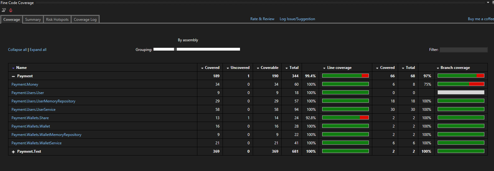
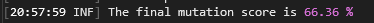
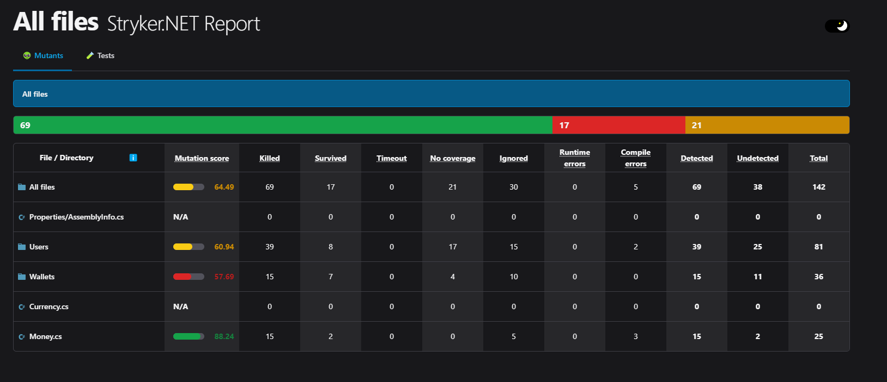
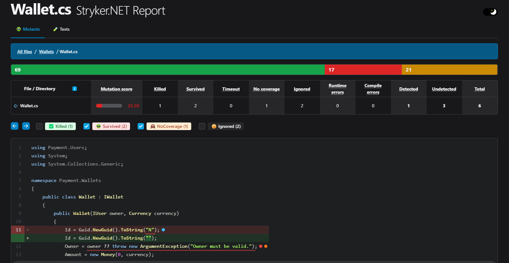
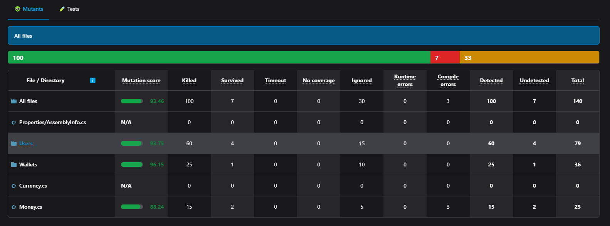
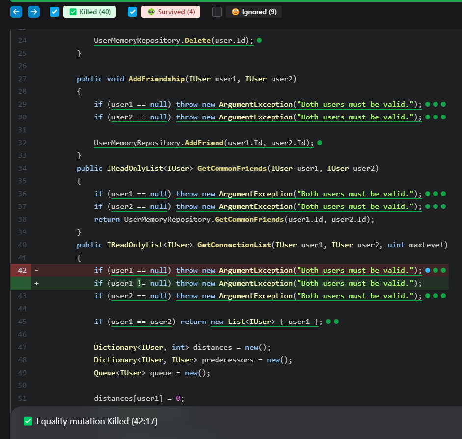

# How to Use Stryker in .NET

## Git Folder Structure

The repository's folder structure consists of:

- **doc**: contains project documentation files.
- **src**: holds the application's source code.
- **test**: contains the test project.

Inside `src`, there's a sample project called "payment" with some logic, while the test project references the payment library and contains some tests.

## Code Analysis

To easily track code coverage within Visual Studio, consider using the FineCodeCoverage extension available [here](https://marketplace.visualstudio.com/items?itemName=FortuneNgwenya.FineCodeCoverage2022).

As depicted below, the code coverage appears satisfactory:

### Analyzing Tests

Achieving a satisfactory test coverage percentage doesn't always ensure well-written tests.

One useful tool to assess the robustness of our tests is [Stryker](https://stryker-mutator.io/).

Stryker.NET is a mutation testing tool designed specifically for .NET Core and .NET Framework projects. By injecting temporary bugs into the codebase, Stryker.NET enables developers to evaluate the resilience of their tests and identify areas for improvement.

Included in the solution is a PowerShell script named `RunStryker.ps1`, which facilitates running Stryker directly from your Visual Studio Developer shell.

After executing Stryker, it provides a mutation score:

However, upon inspection, the mutation score may not meet desired levels. In such cases, consulting the Stryker output for details is advisable:

By clicking on the HTML page, you can inspect which mutation tests survived:

To review the HTML file, simply open this link:
- [Low Mutation Score Report](./docs/StrykerOutput/LowMutationScore/mutation-report.html)

Using this information, we can add new tests to our project in order to eliminate all the mutators.

Here are the results after improvements:

New Total Score:

New Stryker Output:

To review the HTML file, simply open this link:
- [High Mutation Score Report](./docs/StrykerOutput/HighMutationScore/mutation-report.html)

To reproduce the process:

1. Disable or comment out test projects following Test: "UserTestForKillMutators.cs" and "WalletTestForKillMutators.cs".
2. Run Stryker.
3. Re-enable or uncomment the tests.
4. Run Stryker again.